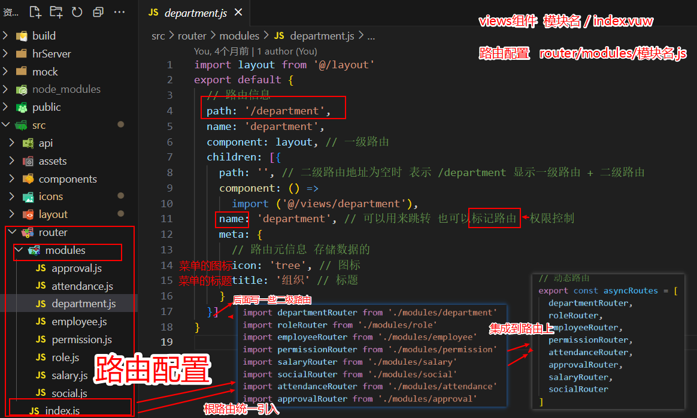

###  项目架构和解决方案


### 课程具备能力


# 登录模块

**页面结构和表单**

```vue
<template>
  <div class="login-container">
      
    <div class="bg-circle">
      
      
      
    </div>
      
    <div class="main">
      
        
      <el-card shadow="never">
        <div class="title">
          
          <h2>人力资源后台管理</h2>
        </div>
          
        <!--登录表单-->
        <el-form>
          <el-form-item>
            <el-input placeholder="请输入手机号">
              <template #prefix>
                
              </template>
            </el-input>
          </el-form-item>

          <el-form-item>
            <el-input placeholder="请输入密码">
              <template #prefix>
                
              </template>
            </el-input>
          </el-form-item>

          <el-form-item>
            <el-input placeholder="请输入验证码">
              <template #prefix>
                
              </template>
              <template #append>
                <span>9 5 2 8</span>
              </template>
            </el-input>
          </el-form-item>

          <el-form-item>
            <el-checkbox>用户平台使用协议</el-checkbox>
          </el-form-item>

          <el-form-item>
            <el-button type="primary" class="login-btn" @click="loginClick">登录</el-button>
          </el-form-item>

        </el-form>

      </el-card>
    </div>
  </div>
</template>

```

**页面样式**

```scss
<style scoped lang="scss">
.login-container {
  position: relative;
  height: 100%;
  background-image: linear-gradient(#3fccfd, #996cfb);
  overflow: hidden;

  // 三个圆形图片的位置
  .bg-circle {
    .lt {
      position: absolute;
      left: 40px;
      top: 40px;
      opacity: 0.3;
    }
    .lb {
      position: absolute;
      left: -250px;
      bottom: -200px;
    }
    .rt {
      position: absolute;
      right: -70px;
      top: -200px;
    }
  }

  // 主体内容
  .main {
    // 水平和垂直居中
    position: absolute;
    left: 50%;
    top: 50%;
    transform: translate(-50%, -50%);
    display: flex;
    align-items: center;

    // 登录卡片
    .el-card {
      margin-left: 60px;

      // 卡片标题
      .title {
        display: flex;
        justify-content: center;
        align-items: center;

        font-size: 23px;
        font-weight: 700;
        font-style: normal;
        color: rgb(67, 141, 238);

        img {
          width: 50px;
          height: 42px;
        }
      }

      // 登录表单文本框
      .el-input {
        width: 350px;
        height: 44px;

        // 文本框内容
        ::v-deep .el-input__inner {
          background-color: #f4f5fb;
          height: 44px;
        }

        // 文本框头部图标样式
        img {
          width: 20px;
          height: 20px;
          margin-top: 12px;
        }

        // 文本框尾部验证码样式
        ::v-deep .el-input-group__append {
          font-family: 'Arial Negreta', 'Arial Normal', 'Arial';
          font-weight: 700;
          font-size: 16px;
          color: #FF7733;
          // height: 44px;
        }
      }

      // 复选款样式
      .el-checkbox {
        color:#606266;
      }

      // 登录按钮样式
      .login-btn {
        width: 350px;
      }
    }
  }
}
</style>

```


### **表单校验和登录请求**

**表单校验**

- 登录数据对象绑定表单

  ```html
  <!--登录表单-->
  <el-form ref="loginForm" :model="loginForm" :rules="loginRules">
    <el-form-item prop="mobile">
      <el-input v-model="loginForm.mobile" placeholder="请输入手机号">
        <template #prefix>
          
        </template>
      </el-input>
    </el-form-item>
    <el-form-item prop="password">  <!-- show-password 显示密文 -->
      <el-input v-model="loginForm.password" show-password  placeholder="请输入密码">
        <template #prefix>
          
        </template>
      </el-input>
    </el-form-item>
    <el-form-item prop="code">
      <el-input v-model="loginForm.code" placeholder="请输入验证码">
        <template #prefix>
          
        </template>
        <template #append>
          <span>9 5 2 8</span>
        </template>
      </el-input>
    </el-form-item>
    <el-form-item prop="isAgree">
      <el-checkbox v-model="loginForm.isAgree">用户平台使用协议</el-checkbox>
    </el-form-item>
    <el-form-item>
      <el-button type="primary" class="login-btn" @click="loginClick">登录</el-button>
    </el-form-item>
  </el-form>
  ```

- 定义登录表单数据对象和校验规则

  ```js
  <script>
  export default {
    data() {
      return {
        // 登录信息
        loginForm: {
          mobile: '',  // 手机号
          password: '',  // 密码
          isAgree: false, // 是否勾选
          code: ''      // 验证码
        },
        // 校验规则
        loginRules: {
          mobile: [
            { required: true, message: '手机号不能为空', trigger: 'blur' },
            { pattern: /^1[3-9]\d{9}$/, message: '手机号格式不正确', trigger: 'blur' }
          ],
          password: [
            { required: true, message: '密码不能为空', trigger: 'blur' },
            { min: 6, max: 16, message: '密码长度6-16位', trigger: 'blur' }
          ],
          isAgree: [
            {
              // 自定义校验函数(校验规则, 要校验的值, 成功或失败的回调函数)
              validator: (rule, value, callback) => {
                // rule 检验规则
                // value 校验的值
                // callback 函数
                // 成功执行callback 失败也执行callback(错误对象 new Error(错误信息))
                value ? callback() : callback(new Error('未勾选用户协议'))
              }
            }
          ],
          code: [
            { required: true, message: '验证码不能为空', trigger: 'blur' },
            { pattern: /^\d{4}$/, message: '验证码是四位数字', trigger: 'blur' }
          ]
        }
      }
  },
  }
  </script>
  ```

  

**登录请求**

- 登录按钮注册点击事件：`@click="loginClick"`

  ```html
  <el-form-item>
    <el-button type="primary" class="login-btn" @click="loginClick">登录</el-button>
  </el-form-item>
  ```

- 整体校验并发送登录请求

  ```js
  <script>
  export default {
    data() {
      return {
        ......
      }
    },
    methods: {
      // 登录提交
      async loginClick() {
          // this.$refs.loginForm.validate((isOK) => {
          //     if(isOK) { 通过校验 跳转 }
          //})
        const res = await this.$refs.loginForm.validate()
        if (res) {
          // Vuex的actions返回的是Promiss对象
          await this.$store.dispatch('user/login', this.loginForm)
          // 如果登录成功，跳转到首页
          this.$router.push('/')
        }
      }
    }
  }
  </script>
  ```


> 备用的登录信息

```js
// 登录信息
loginForm: {
  mobile: process.env.NODE_ENV === 'development' ? '13800000002' : '',
    password: process.env.NODE_ENV === 'development' ? 'hm#qd@23!' : '',
      isAgree: process.env.NODE_ENV === 'development',
        code: process.env.NODE_ENV === 'development' ? '1274' : ''
},
```

​    

### 分析登录流程

> 传统思路都是登录校验通过之后，直接调用接口，获取token之后，跳转到主页。

- **vue-element-admin的登录思路：**

1. 登录表单校验通过
2. 调用Vuex提供的登录的action
3. 登录的Action中会调用接口
4. 登录接口如果成功执行，会返回token
5. 利用Vuex的特性，将token共享的到Vuex中，这样Vuex就统一管理了token,别的地方想要使用，直接通过Vuex就可以
6. 登录接口会调用单独封装的请求模块(api)
7. 请求模块中又会使用用到axios封装的请求工具
8. 而请求工具又要考虑区分 开发环境和生产环境的问题
9. 请求时还要考虑前后分离项目产生的跨域问题，要使用代理解决跨域


### `vuex`的持久化  `/modules/user.js`

```js
import { setToken, getToken, removeToken } from '@/utils/auth'
import { login, getUserInfo } from '@/api/user'

const state = {
  token: getToken() // 从缓存中读取初始值
}

const mutations = {
  // 修改token（登录操作）
  setToken(state, token) {
    state.token = token
    // 同步到缓存 （不同步页面一刷新就会丢失）
    setToken(token)
  },
    
  // 删除token（退出操作）
  removeToken(state) {
    // 删除Vuex的token
    state.token = null
    // 删除缓存
    removeToken()
  }
}
                                                    
const actions = {
  // context 上下文，传入参数
  login(context, data) {
    // console.log(data) // 已传入参数
    // todo ： 调用登陆接口
    const token = await login(data)
    // 接口返回一个token 把token进行共享
    // 提交
    context.commit('setToken', token)
  }
}

export default {
  namespaced: true, // 开启命名空间 所以我们调用action的时候要加上模块名称如**user/login**
  state,
  mutations,
  actions
}

```


### Vue-cli代理解决跨域（开发环境）

> **请求模块-axios封装-跨域-区分环境**


> 我们要先把跨域问题解决才能考虑其他内容的开发,否则请求接口是不通的。

- 首先为什么会有跨域？


> 在后端没有开启cors的情况下，浏览器的同源策略会直接限制后端返回的数据给到前端。这是因为我们目前所有的项目都是前后分离，前端一个服务， 后端一个服务，后端不开cors只能前端自己想办法。

- 代理是怎么解决跨域的？


> 既然前端不能直接请求后端服务，那就搞个中间服务，中间服务刚好和我们的前端服务同源，前端和中间服务可以通信，而中间服务是node, node后台向后端发请求是不受同源策略影响的，因为**同源策略只针对浏览器！！！**， 这样就是代理，中间层的服务将前端的请求代理给了后端接口。


- 具体怎么做呢？

> 跨域有开发环境跨域和生产环境跨域，我们最后上线的时候要考虑生产环境跨域，目前只需要考虑开发环境。

- 配置文件可以直接配置代理 vue.config.js

```javascript
  devServer: {
    port: port,
    open: true,
    overlay: {
      warnings: false,
      errors: true
    },
    proxy: {
        // path: 目标服务器 百度 新浪 网易...改完重启服务器
        // /api:因为我们请求地址里有 /api
      '/api': {
        target: 'https://heimahr.itheima.net'    
      }
    }
      // 基础模板做的模拟数据，拦截请求
    // before: require('./mock/mock-server.js')
  },
      
// url:'/api/sys/login' => http://localhost:9528/api/sys/login => https://heimahr.itheima.net/api/sys/login
// 做了一个转发服务
      
// 有 /api 自动专向方向地址 所有基地址是 /api
```


### axios二次封装

> 完成了代理跨域，就可以考虑axios的封装了。


> axios封装主要封装做哪些呢？

- 基础地址，超时时间
- 请求拦截器-统一注入token
- 响应拦截器-解构数据-处理异常


- axios的基础功能


代码位置(`src/utils/request.js`)

```javascript
import axios from 'axios'
import store from '@/store'
import { Message } from 'element-ui'

const service = axios.create({ // 创建一个新的axios实例
  baseURL: '/api', // 基础地址(因为反向代理了)
  timeout: 10000 // 超时时间 毫秒
}) 

// 请求拦截器
// 成功执行第一个，失败执行第二个
service.interceptors.request.use((config) => {
  // 请求接口  config是请求配置
  // 注入token
  // this.$getters.token  this组件实例，现在不是组件
  // store.getters.token => 请求头里面
  if (store.getters.token) {
    // 只要有token，就要检查token的时效性
    // 如果存在token，注入token
    config.headers.Authorization = `Bearer ${store.getters.token}`
  }

  // 一定要 return config ！！！！！！！
  return config
}, (error) => {
  // 失败执行promise
  return Promise.reject(error)
})

// 响应拦截器
service.interceptors.response.use((response) => {
  // 成功执行
  // axios默认包裹了一层data
  // 响应数据解构出来
  const { data, message, success } = response.data // 默认json格式
  if (success) {
    // 此时认为业务执行成功了
    return data // 返回用户所需要的数据
  } else {
    // 当业务失效的时候
    Message({ type: 'error', message }) // 提示消息
    return Promise.reject(new Error(message))
  }
}, async(error) => {
  // error.message
  // this 只能在组件里用
  Message({ type: 'error', message: error.message })
  return Promise.reject(error)
})

export default service

```

### 环境区分


- 将`.env.development`中的值改为` /api `作为请求工具的基础地址

  ```js
  // .env.development 开发环境
  # just a flag
  ENV = 'development'
  
  # base api
  VUE_APP_BASE_API = '/api'
  
  ```

- **`process.env.VUE_APP_BASE_API `**的表示读取该变量，yarn dev时该变量为 /api,  yarn build:prod时 该变量为 /prod-api

  ```js
  // .env.production 生产环境
  # just a flag
  ENV = 'production'
  
  # base api
  VUE_APP_BASE_API = '/prod-api'
  
  ```

  ​    

**登录联调**

> 目前登录功能只剩下红色的部分还需要


- 区分不同环境的数据

> 因为开发环境为了便利，我们将用户的账户信息和密码都默认写在了页面上，但是真正的项目我们不可能将数据进行暴露出去，所以在生产环境时应该将 用户的手机号和密码抹去

```javascript
export default {
  name: 'Login',
  data() {
    return {
       loginForm: {
        mobile: process.env.NODE_ENV === 'development' ? '13800000002' : '',
        password: process.env.NODE_ENV === 'development' ? 'hm#qd@23!' : '',
        isAgree: process.env.NODE_ENV === 'development',
        code: process.env.NODE_ENV === 'development' ? '1274' : ''
      },
    }
  }
}
```


# 主页模块

### 主页鉴权-主页权限验证

> 当前项目用户是否有权限访问主页，要考虑当前有没有token,  如果有token, 用户还想去登录页，我们可以直接去主页-这个就是免登录功能。有token的情况下，直接到主页。


- 访问主页-有token放过，没有token跳到登录页
- 访问登录-有token跳到主页（不让跳转，只有退出登录），没有token放过

代码实现-代码位置(**src/pemission.js**)

```javascript
import router from '@/router'
import nprogress from 'nprogress'
import 'nprogress/nprogress.css'
import store from '@/store'


// 路由前置守卫
const whiteList = ['/login', '/404']
router.beforeEach(async(to, from, next) => {
    
  nprogress.start() // 开启进度条，路由跳转之前开启
    
  if (store.getters.token) {
    // 存在token
    if (to.path === '/login') {
      // 跳转到主页
      next('/') // 中转到主页
      // next（地址）并没有执行后置守卫
      nprogress.done()  // 手动关闭进度条
    } else {
       
        // 这里判断是否获取过资料 if(!store.getters.userId) store.dispath('user/getUserInfo')
       next() // 放行
    }
  } else {
    // 没有token
    if (whiteList.includes(to.path)) {
      next()
    } else {
      next('/login') // 中转到登录页
      nprogress.done()
    }
  }
})

// 路由后置守卫
router.afterEach(() => {
  nprogress.done() // done完成  关闭进度条
})

```


### 处理token失效的问题

> token是有时效性的，当token超时，我们需要做一下处理


- 请求拦截器处理-代码位置(**src/utils/request.js**)

```javascript
// 响应拦截器
service.interceptors.response.use(..., async(error) => {
    // console.log(error)
  if (error.response.status === 401) {
    Message({ type: 'warning', message: 'token超时了' })
    // 说明token超时了
    // 调用action中的退出登录
    await store.dispatch('user/logout') 
    //  主动跳到登录页
    router.push('/login') // 跳转到登录页
    return Promise.reject(error)
  }
  // error.message
  Message.error(error.message)
  return Promise.reject(error)
})
```

- 实现Vuex的登出action-代码位置(**src/store/modules/user.js**)

```javascript
const actions = {
  // 退出登录的action
  logout(context) {
    context.commit('removeToken') // 删除token
    context.commit('setUserInfo', {}) // 设置用户信息为空对象
  }
}
```


### 路由配置




### 解析左侧菜单原理


> **左侧菜单的数据来源于路由模块的信息， 会根据路由信息的hidden属性来判断是否显示该路由信息到菜单，**
> **菜单属性中的图表和标题来源于路由meta中的icon和title属性**


- 分析过程

sidebar组件引入路由信息

循环渲染路由信息

sidebarItem组件根据条件渲染-传递icon和title属性给item组件

item组件接收icon和title属性，使用函数型组件完成渲染


# 进入行内编辑


- 获取数据之后针对每个数据定义标识-使用$set

```javascript
 // 针对每一行数据添加一个编辑标记
      this.list.forEach(item => {
        // item.isEdit = false // 添加一个属性 初始值为false
        // 数据响应式的问题  数据变化 视图更新
        // 添加的动态属性 不具备响应式特点
        // this.$set(目标对象, 属性名称, 初始值) 可以针对目标对象 添加的属性 添加响应式
        this.$set(item, 'isEdit', false)
      })
```

> 为什么不使用item.isEdit = false , 因为动态添加的属性不具备响应式的特点，如果想要具备响应式，可以使用$set


- 点击编辑时，将当前行的标记isEdit设置为true

```vue
<el-table-column align="center" label="操作">
    <template v-slot="{row}">
        <!-- 非编辑状态 -->
        <el-button size="mini" type="text">分配权限</el-button>
        <el-button size="mini" type="text" @click="btnEditRow(row)">编辑</el-button>
        <el-button size="mini" type="text">删除</el-button>
    </template>
</el-table-column>
```

- 点击编辑的方法

```javascript
    // 点击编辑行
    btnEditRow(row) {
      row.isEdit = true // 改变行的编辑状态
    }
```

- 表格列中根据当前的isEdit标记-渲染结构

```html
<el-table-column prop="name" align="center" width="200" label="角色">
      <template v-slot="{ row }">
        <!-- 条件判断 -->
        <el-input v-if="row.isEdit" size="mini" />
        <span v-else>{{ row.name }}</span>
      </template>
</el-table-column>
<el-table-column prop="state" align="center" width="200" label="启用">
          <!-- 自定义列结构 -->
    <template v-slot="{ row }">
        <el-switch v-if="row.isEdit" />
        <span v-else>  {{ row.state === 1 ? "已启用" : row.state === 0 ? "未启用" : "无" }} </span>
    </template>
</el-table-column>
<el-table-column prop="description" align="center" label="描述">
     <template v-slot="{ row }">
            <el-input v-if="row.isEdit" type="textarea" />
            <span v-else>{{ row.description }}</span>
      </template>
</el-table-column>
 <el-table-column align="center" label="操作">
    <template v-slot="{ row }">
        <template v-if="row.isEdit">
            <!-- 编辑状态 -->
            <el-button type="primary" size="mini">确定</el-button>
            <el-button size="mini">取消</el-button>
        </template>
        <template v-else>
              <!-- 非编辑状态 -->
            <el-button size="mini" type="text">分配权限</el-button>
            <el-button size="mini" type="text" @click="btnEditRow(row)">编辑</el-button>
            <el-button size="mini" type="text">删除</el-button>
        </template>
    </template>
</el-table-column>
```

> $set的应用

- this.$set(目标对象, 属性名称, 初始值 ) 
- 等价于 Vue.set(目标对象, 属性名称, 初始值)
- 向响应式对象中添加一个属性，并确保这个新属性同样是响应式的，且触发视图更新。

### 行内编辑-数据缓存

> 为什么要做数据缓存？

答： 因为编辑时，可以取消会滚到之前的状态，所以编辑时的数据是临时的数据。


如图，editRow的数据是针对当前行的数据做了一份拷贝，针对这个拷贝，我们可以随意修改。

- 初始化时缓存数据-代码位置(**src/views/role/index.vue**)

```javascript
    this.list.forEach(item => {
        // item.isEdit = false // 添加一个属性 初始值为false
        // 数据响应式的问题  数据变化 视图更新
        // 添加的动态属性 不具备响应式特点
        // this.$set(目标对象, 属性名称, 初始值) 可以针对目标对象 添加的属性 添加响应式
        this.$set(item, 'isEdit', false)
        this.$set(item, 'editRow', {
          name: item.name,
          state: item.state,
          description: item.description
        })
  })

```

- 点击编辑时更新缓存数据-代码位置(**src/views/role/index.vue**)

```javascript
btnEditRow(row) {
      row.isEdit = true // 改变行的编辑状态
      // 更新缓存数据
      row.editRow.name = row.name
      row.editRow.state = row.state
      row.editRow.description = row.description
}
```

- 将编辑时的表单双向绑定缓存数据-代码位置(**src/views/role/index.vue**)

```html
        <el-table-column prop="name" align="center" width="200" label="角色">
          <template v-slot="{ row }">
            <!-- 条件判断 -->
            <el-input v-if="row.isEdit" v-model="row.editRow.name" size="mini" />
            <span v-else>{{ row.name }}</span>
          </template>
        </el-table-column>
        <el-table-column prop="state" align="center" width="200" label="启用">
          <!-- 自定义列结构 -->
          <template v-slot="{ row }">
            <!-- 开 1 关 0 -->
            <el-switch v-if="row.isEdit" v-model="row.editRow.state" :active-value="1" :inactive-value="0" />
            <span v-else>  {{ row.state === 1 ? "已启用" : row.state === 0 ? "未启用" : "无" }} </span>
          </template>
        </el-table-column>
        <el-table-column prop="description" align="center" label="描述">
          <template v-slot="{ row }">
            <el-input v-if="row.isEdit" v-model="row.editRow.description" size="mini" type="textarea" />
            <span v-else>{{ row.description }}</span>
          </template>
        </el-table-column>
```


# 员工管理


**选中首个节点**


**获取员工数据**


**员工分页处理**


### 员工的防抖查询


- 设置模糊搜索的参数字段

```javascript
data () {
  return {
    queryParams: {
        departmentId: null,
        page: 1, // 当前页码
        pagesize: 10,
        keyword: '' // 模糊搜索字段
      },
  }
}
```

- 双向绑定input输入框，监听值改变事件

```html
<el-input
          v-model="queryParams.keyword"
          style="margin-bottom:10px"
          type="text"
          prefix-icon="el-icon-search"
          size="small"
          placeholder="输入员工姓名全员搜索"
          @input="changeValue"
/>
```

> 这里监听的事件是input，有同学可能会问，为什么不用change事件，注意change事件是离开焦点触发，input是只要内容发生变化就会触发，所以这里使用input更符合使用场景

- 值改变查询数据-支持防抖查询

```js
// 输入值内容改变时触发
changeValue() {
      // 单位时间内只执行最后一次
      // this的实例上赋值了一个timer的属性
      clearTimeout(this.timer) // 清理上一次的定时器
      this.timer = setTimeout(() => {
        this.queryParams.page = 1  // 页码改为1
        this.getEmployeeList()     // 获取员工列表
      }, 300)
}

// 第一次进入 changeValue 清理定时器，没得清理。正常去开启定时器，300ms后去执行
// 这个时候迅速的输入，定时器还没结束的时候呢又进来了这个changeValue
// 这个时候 timer 有值，就把它给清掉了。说明把刚刚做的定时器给清除掉了
// 之后呢，又开了一个定时器，这个时候不再去输入了，就会等到300ms结束之后去执行这个逻辑了
// 降低访问频率 单位时间内只执行最后一次 防抖
```


### 导出excel


- 导出员工接口返回的是二进制流
- `axios`配置`responseType`为`blob`接收二进制流文件为Blob格式
- 安装`file-saver`包，实现下载Blob文件  `yarn add file-saver`

- 封装导出员工excel的API

```javascript
/**
 * 导出员工的excel
 * **/

export function exportEmployee() {
  return request({
    url: '/sys/user/export',
    // 改变接收数据的类型
    responseType: 'blob' // 使用blob接收二进制文件流
  })
}
```

- 拦截器判断是不是blob类型，如果是直接返回数据，不再进行解构-代码位置(**src/utils/request.js**)

```javascript
// 响应拦截器
service.interceptors.response.use((response) => {
  // axios默认包裹了data
  // 判断是不是Blob
  if (response.data instanceof Blob) return response.data // 返回了Blob对象
    
  const { data, message, success } = response.data // 默认json格式
  if (success) {
    return data
  } else {
    Message({ type: 'error', message })
    return Promise.reject(new Error(message))
  }
},
```


- 安装file-saver

```bash
$ npm i file-saver
$ yarn add file-saver
```

- 点击按钮调用接口，使用file-saver将blob转化成文件下载-代码位置(**src/views/employee/index.vue**)

```javascript
<el-button size="mini" @click="exportEmployee">excel导出</el-button>

 import FileSaver from 'file-saver'
 import { exportEmployee } from '@/api/employee'

  async  exportEmployee() {
      const result = await exportEmployee() // 导出所有的员工接口
      // console.log(result) // 使用一个npm包 直接将blob文件下载到本地 file-saver
      // FileSaver.saveAs(blob对象,文件名称)    什么格式都可以~
      FileSaver.saveAs(result, '员工信息表.xlsx') // 下载文件  
 }
```

### excel组件封装


- 封装员工导入组件

```html
<template>
  <el-dialog
    width="500px"
    title="员工导入"
    :visible="showExcelDialog"
    @close="$emit('update:showExcelDialog', false)"
  >
    <el-row type="flex" justify="center">
      <div class="upload-excel">
        <input
          ref="excel-upload-input"    //  this.$refs['excel-upload-input'] 获取
          class="excel-upload-input"
          type="file"
          accept=".xlsx, .xls"        // 只接收excel文件
        >
        <div class="drop">
          <i class="el-icon-upload" />
          <el-button type="text">下载导入模板</el-button>
          <span>将文件拖到此处或
            <el-button type="text">点击上传</el-button>
          </span>
        </div>
      </div>
    </el-row>
    <el-row type="flex" justify="end">
      <!-- update:props属性名，值 直接修改 .sync修饰符的属性值 -->
      <el-button size="mini" type="primary" @click="$emit('update:showExcelDialog', false)">取消</el-button>
    </el-row>
  </el-dialog>
</template>
<script>

export default {
  props: {
      // 接收一个属性控制弹层的显示与否
    showExcelDialog: {
      type: Boolean,
      default: false
    }
  },
  methods: {

  }
}
</script>

<style scoped lang="scss">
    .upload-excel {
      display: flex;
      justify-content: center;
      margin: 20px;
      width: 360px;
      height: 180px;
      align-items: center;
      color: #697086;
      .excel-upload-input {
        display: none;
        z-index: -9999;
      }
      .btn-upload,
      .drop {
        border: 1px dashed #dcdfe6;
        width: 100%;
        height: 100%;
        text-align: center;
        line-height: 160px;
        border-radius: 8px;
        display: flex;
        flex-direction: column;
        justify-content: center;
      }
      .drop {
        line-height: 40px;
        color: #bbb;
        i {
          font-size: 60px;
          display: block;
          color: #c0c4cc;
        }
      }
    }
</style>
```

- 在员工管理页面-导入该组件并注册使用

```javascript
import ImportExcel from './components/import-excel.vue'

export default {
  components: {
    ImportExcel
  }
}
}
```

- 声明一个控制该弹层的变量

```javascript
data () {
  return  {
      showExcelDialog: false // 控制excel的弹层显示和隐藏
  }
}
```

- 使用该组件，并且应用变量-

```html
    <import-excel :show-excel-dialog.sync="showExcelDialog" />

```

- 点击员工导入弹出层

```html
 <el-button size="mini" @click="showExcelDialog = true">excel导入</el-button>
```


### 下载导入模板


- 封装下载模板的API

```javascript
/**
 * 下载员工导入模版
 * **/

export function getExportTemplate() {
  return request({
    url: '/sys/user/import/template',
    responseType: 'blob' // 二进制文件流
  })
}

```

- 点击按钮进行下载模板

```javascript
<el-button type="text" @click="getTemplate">下载导入模板</el-button>

async getTemplate() {
    const data = await getExportTemplate()
    FileSaver.saveAs(data, '员工导入模版.xlsx')
 }

```


### 员工导入-上传excel


- 封装上传excel的API

```javascript
/**
 * 上传用户的excel
 *
*/
export function uploadExcel(data) {
  return request({
    url: '/sys/user/import',
    method: 'post',
    data // form-data类型 因为要上传文件类型
  })
}
```

- 点击上传-弹出文件选择框

```javascript
<el-button type="text" @click="handleUpload">点击上传</el-button>

handleUpload() {
      this.$refs['excel-upload-input'].click() // this.$refs.属性名 和 this.$refs[属性名] 等价
},
```

- 监听文件改变-上传excel-关闭弹层

```javascript
 <input
          ref="excel-upload-input"
          class="excel-upload-input"
          type="file"
          accept=".xlsx, .xls"
          @change="uploadChange"
  >
              
  async uploadChange(event) {
      console.log(event.target.files)  // 拿到文件列表
      // 调用上传接口
      // uploadExcel() // 参数  form-data 需要文件file
      const files = event.target.files // input的文件列表
      if (files.length > 0) {
        // 大于0 说明有文件要上传
        const data = new FormData()
        // file: file类型
        data.append('file', files[0]) // 将文件参数加入到formData中
        try {
          await uploadExcel(data)
          // 成功
          this.$emit('uploadSuccess') // 通知父组件 我上传成功 重新加载员工列表
          this.$emit('update:showExcelDialog', false) // 关闭弹层
          // this.$refs['excel-upload-input'].value = ''
        } catch (error) {
          // 捕获失败  清空文件选择器
          // this.$refs['excel-upload-input'].value = ''
        } finally {
          // 不论成功或者失败都会执行finally
          this.$refs['excel-upload-input'].value = ''
        }
      }
}
```

> 这里为什么不管成功或者失败都要清空文件选择器中的内容呢？ 因为不论成功或者失败，再点击上传都会去选择一个新的excel，所以这里使用finally等到最后，将内容清空。

- 父组件需要监听上传成功的事件-代码位置(**src/views/employee/index.vue**)

```html
<import-excel :show-excel-dialog.sync="showExcelDialog" @uploadSuccess="getEmployeeList" />

// getEmployeeList 获取员工列表的方法 有了
```


# 员工详情-cos上传

### 封装部门级联组件


**Cascader级联组件的特性**

1. options为一个树形结构的数据源
2. props可以设置数据源中的字段如 label (展示)  value（存取）
3. separator为展示的分隔符


- 创建select-tree组件

```vue
<template>
  <!-- element-ui级联组件 -->
  <el-cascader
    size="mini"
    :options="treeData" // 绑定要显示的数组
    :props="props"   
    separator="-"
  />
</template>
<script>
import { getDepartment } from '@/api/department'
import { transListToTreeData } from '@/utils'
export default {
  data() {
    return {
      treeData: [], // 赋值给 级联组件的options
      props: {
        label: 'name', // 要展示的字段
        value: 'id' // 要存储的字段
      }
    }
  },
  created() {
    this.getDepartment()
  },
  methods: {
    async getDepartment() {
      this.treeData = transListToTreeData(await getDepartment(), 0) // 将组织架构的数据 转化树形赋值给treeData
    }
  }
}
</script>
```

- 解决转化树形中的问题

```javascript
/**
 *
 * 列表型数据转化树形
*/

export function transListToTreeData(list, rootValue) {
  const arr = []
  list.forEach(item => {
    if (item.pid === rootValue) {
      // 找到了匹配的节点
      arr.push(item)
      // 当前节点的id 和 当前节点的子节点的pid是想等的
      const children = transListToTreeData(list, item.id) // 找到的节点的子节点
      if (children.length) { item.children = children } // 将子节点赋值给当前节点
    }
  })
  return arr
}
```

> 这里我们加了一个判断，就是只有当前节点有子节点时才添加children属性，否则会造成级联组件本身就已经是最末端了，但是发现它的children属性存在，就会呈现不同的表现形式。

- 使用select-tree组件

> 不要忘记引入注册

```html
<el-form-item label="部门" prop="departmentId">
      <!-- 放置及联部门组件 会单独封装-->
      <!-- inputW样式会给到selectTree中 template第一层的组件 -->
      <select-tree class="inputW" />
</el-form-item>
```


**级联组件-双向绑定**


- 接收value属性-

```js
export default {
  props: {
    value: {
      type: Number, // 存储的是部门的id  3 4 5
      default: null
    }
  }
}
```

- 级联改变触发input事件

```javascript
 <el-cascader
    :value="value"
    size="mini"
    :options="treeData"
    :props="props"
    separator="-"
    @change="changeValue"
  />
// 值改变的时候触发事件
 changeValue(list) {
      // 取到数组的最后一次
      if (list.length > 0) {
        this.$emit('input', list[list.length - 1]) // 将最后一位的id取出来 传出去
      } else {
        this.$emit('input', null) // 如果长度为0 说明值为空
      }
}
```

- 在父组件使用v-model双向绑定-

```html
<select-tree v-model="userInfo.departmentId" class="inputW" />

```


### 封装员工头像组件


- 封装image-upload组件

```vue
<template>
  <el-upload
    class="avatar-uploader"
    action=""
    :show-file-list="false"
    :before-upload="beforeAvatarUpload"  // 上传前检查
  >
    <!-- (自动上传)action是上传地址 人资项目不需要 人资项目(手动上传)  -->
    <!-- show-file-list不展示列表 -->
    
    <i v-else class="el-icon-plus avatar-uploader-icon" />
  </el-upload>
</template>

<script>
export default {
  props: {
    value: {
      type: String,
      default: ''
    }
  },
  methods: {
    // 检查函数 判断文件的类型还有大小 return  true(继续上传)/false(停止上传)
    beforeAvatarUpload(file) {
      // jpeg png gif bmp

      const isJPG = ['image/jpeg', 'image/png', 'image/gif', 'image/bmp'].includes(file.type)
      const isLt2M = file.size / 1024 / 1024 < 5 // 5M

      if (!isJPG) {
        this.$message.error('上传头像图片只能是 JPG PNG GIF BMP 格式!')
      }
      if (!isLt2M) {
        this.$message.error('上传头像图片大小不能超过 5MB!')
      }
      return isJPG && isLt2M
    }
  }
}
</script>

<style>
  .avatar-uploader .el-upload {
    border: 1px dashed #d9d9d9;
    border-radius: 6px;
    cursor: pointer;
    position: relative;
    overflow: hidden;
  }
  .avatar-uploader .el-upload:hover {
    border-color: #409EFF;
  }
  .avatar-uploader-icon {
    font-size: 28px;
    color: #8c939d;
    width: 178px;
    height: 178px;
    line-height: 178px;
    text-align: center;
  }
  .avatar {
    width: 178px;
    height: 178px;
    display: block;
  }
</style>
```

- 在父组件中应用-代码位置(**src/views/employee/detail.vue**)

```html
  <image-upload v-model="userInfo.staffPhoto" />
```


### 创建腾讯云存储桶


1.注册腾讯云账号-课前完成[https://cloud.tencent.com/login](https://cloud.tencent.com/login)  
2.创建腾讯云存储桶
3.得到应用密钥和应用标识

- 创建存储桶


**2.1获取存储桶相关信息**


> 将存储桶和所属地域拷贝下来，备用

- 获取应用标识[https://console.cloud.tencent.com/cam/capi](https://console.cloud.tencent.com/cam/capi)


> 将SecretId和SecretKey拷贝下来，备用


### 使用cos-sdk完成上传


- 安装腾讯云js-sdk

```bash
$ npm i cos-js-sdk-v5 
$ yarn add  cos-js-sdk-v5

```

- 使用el-upload自定义上传-代码位置

```html
<template>
  <el-upload
    class="avatar-uploader"
    action=""
    :show-file-list="false"
    :before-upload="beforeAvatarUpload"
    :http-request="uploadImage"  // 选择图片的时候上传
  >
    <!-- (自动上传)action是上传地址 人资项目不需要 人资项目(手动上传)  -->
    <!-- show-file-list不展示列表 -->
    
    <i v-else class="el-icon-plus avatar-uploader-icon" />
  </el-upload>
</template>

```

- 实现上传方法-代码位置

```javascript
    // 选择图片上传
    uploadImage(params) {
      // console.log(params.file)  要上传的文件
      const cos = new COS({
        SecretId: 'AKIDDSdjgnjT1NZ3a7VjkfVIwOdfv9IH2b8e',
        SecretKey: 'WEwe9WJ9vLeq1BHNLLKF5Up10ndUDk24'
      }) // 完成cos对象的初始化
      cos.putObject({
        Bucket: 'heimachengxuyuan-1302806742', // 存储桶名称
        Region: 'ap-nanjing', // 地域名称
        Key: params.file.name, // 文件名称
        StorageClass: 'STANDARD', // 固定值
        Body: params.file // 文件对象
      }, (err, data) => {
        if (data.statusCode === 200 && data.Location) {
          // 拿到了腾讯云返回的地址
          // 通过input自定义事件将地址传出去
          this.$emit('input', 'http://' + data.Location) // 将地址返回了
        } else {
          this.$message.error(err.Message) // 上传失败提示消息
        }
      })
    }
```

> 这里需要使用 上个小节准备好的存储桶的名称-地域名称-应用标识-应用密钥


这里需要知道Cos的初始化和上传的方法


# 权限管理


### 权限概念


> 权限是通过角色这个中间人实现，首先员工拥有角色，角色拥有权限，那么员工自动拥有了角色所对应的权限。

所以接下来，我们需要实现 给员工分配角色，给角色分配权限。

- 分配过程-给员工分角色


- 分配过程-给角色分权限


### 员工分配角色


- 封装获取可用角色的API

```javascript
// 获取可用的角色
export function getEnableRoleList() {
  return request({
    url: '/sys/role/list/enabled'
  })
}
```

- 声明变量控制弹层显示-和角色列表

```javascript
data () {
  return {
      showRoleDialog: false, // 用来控制角色弹层的显示
      roleList: [], // 接收角色列表
      roleIds: [] // 用来双向绑定数据的
  }
}
```

- 点击角色按钮-获取角色列表

```javascript
// 点击角色按钮弹出层
    async btnRole() {
      this.showRoleDialog = true
      this.roleList = await getEnableRoleList()
    }
```

- 放置弹层-绑定变量和渲染checkbox

```html
<el-dialog :visible.sync="showRoleDialog" title="分配角色">
      <!-- 弹层内容 -->
      <el-checkbox-group v-model="roleIds">
        <!-- 放置n个的checkbox  要指定checkbox的存储值:label item.id-->
        <el-checkbox v-for="item in roleList" :key="item.id" :label="item.id">{{ item.name }}</el-checkbox>
     </el-checkbox-group>
</el-dialog>
```

**回显数据并提交**


- 封装给员工分配角色的接口

```javascript
// 分配员工角色
export function assignRole(data) {
  return request({
    url: '/sys/user/assignRoles',
    method: 'put',
    data
  })
}
```

- 点击角色按钮时，获取员工已经拥有的角色，并记录当前点击的用户id

  在data中声明一个id用来记录

```javascript
data () {
  return  {
    currentUserId: null // 用来记录当前点击的用户id
  }
}
```

```javascript
async btnRole(id) {
      this.roleList = await getEnableRoleList()
      // 记录当前点击的id 因为后边 确定取消要存取给对应的用户
      this.currentUserId = id
      // 获取用户拥有的角色 
      const { roleIds } = await getEmployeeDetail(id)
      this.roleIds = roleIds
      this.showRoleDialog = true // 调整顺序
},
```

> 注意，这里我们特地调整了弹层的顺序，因为获取已经拥有的角色是一个异步的过程，如果弹层显示在前，会出现卡顿的效果，表现出缓慢的效果，所以等到获取所有数据之后再弹层。

- 点击确定实现给用户分配角色

```javascript
 // 点击角色的确定
    async  btnRoleOK() {
      await assignRole({
        id: this.currentUserId,
        roleIds: this.roleIds
      })
      this.$message.success('分配用户角色成功')
      this.showRoleDialog = false
    }
```

- 取消关闭弹层

```html
<el-row slot="footer" type="flex" justify="center">
  <el-col :span="6">
    <el-button type="primary" size="mini" @click="btnRoleOK">确定</el-button>
    <el-button size="mini" @click="showRoleDialog = false">取消</el-button>
  </el-col>
</el-row>
```

### 给角色分配权限


- 声明变量控制弹层显示和接收权限数据

```javascript
data () {
  return {
     showPermissionDialog: false,
     permissionData: []
  }
}
```

- 点击分配权限-弹出层-获取数据并转化树形

```javascript
<el-button size="mini" type="text" @click="btnPermission">分配权限</el-button>

async  btnPermission() {
      this.showPermissionDialog = true
      this.permissionData = transListToTreeData(await getPermissionList(), 0)
}
```

- 放置弹层和树组件

```html
<!-- 放置权限弹层 -->
    <el-dialog :visible.sync="showPermissionDialog" title="分配权限">
      <!-- 放置权限数据 -->
      <el-tree
        :data="permissionData"  // 能显示结构看不见字段
        :props="{ label: 'name' }"  // 要展示的字段
        show-checkbox             // 节点是否可被选择
        default-expand-all
      />
    </el-dialog>
```

**显示已有权限数据**


- 封装获取角色详情的API

```javascript
// 获取角色详情
export function getRoleDetail(id) {
  return request({
    url: `/sys/role/${id}`
  })
}
```

- 声明变量记录当前点击的角色id和角色所拥有的权限数据

```javascript
data () {
  return {
      currentRoleId: null,  // 记录当前点击的角色 id
      permIds: []  // 角色所拥有的权限
  }
}
```

- 点击分配权限按钮时传递角色id，并根据id获取该角色所拥有的权限

```javascript
<el-button size="mini" type="text" @click="btnPermission(row.id)">分配权限</el-button>

async  btnPermission(id) {
      this.currentRoleId = id  // 记录id
      // 根据id获取该角色所拥有的权限
      const { permIds } = await getRoleDetail(id)
      this.permIds = permIds
    
      this.permissionData = transListToTreeData(await getPermissionList(), 0)
      this.showPermissionDialog = true
}
```

- 设置el-tree组件的属性-node-key和当前选中数据

```html
<el-tree
        ref="premTree"
        node-key="id" // 表示哪个字段是唯一的
        check-strictly   // 父子不互相关联
        :data="permissionData"
        :props="{ label: 'name' }"
        show-checkbox
        default-expand-all
         
        :default-checked-keys="permIds"  // 当前选中数据 
  />
```

> default-checked-keys的属性是设置当前选中的节点，但是必须配合node-key属性，因为permIds变量中存储的都是id，必须el-tree组件知道key是哪个字段，所以设置node-key="id"

**确定提交**


- 封装分配权限的接口API

```javascript
// 给角色分配权限
export function assignPerm(data) {
  return request({
    url: '/sys/role/assignPrem',
    method: 'put',
    data
  })
}
```

- 确定和取消事件

```javascript
 <el-row slot="footer" type="flex" justify="center">
        <el-col :span="6">
          <el-button type="primary" size="mini" @click="btnPermissionOK">确定</el-button>
          <el-button size="mini" @click="showPermissionDialog = false">取消</el-button>
      </el-col>
  </el-row>

// 点击确定时触发
    async  btnPermissionOK() {
      await assignPerm({
        id: this.currentRoleId,
        permIds: this.$refs.permTree.getCheckedKeys()  // 选择目前被选中的节点
      })
      this.$message.success('角色分配权限成功')
      this.showPermissionDialog = false
    }
```


### 拆分静态路由-动态路由

- 将静态路由和动态路由进行拆分

```javascript
import Vue from 'vue'
import Router from 'vue-router'

Vue.use(Router)

/* Layout */
import Layout from '@/layout'
import departmentRouter from './modules/department'
import approvalRouter from './modules/approval'
import attendanceRouter from './modules/attendance'
import employeeRouter from './modules/employee'
import permissionRouter from './modules/permission'
import roleRouter from './modules/role'
import salaryRouter from './modules/salary'
import socialRouter from './modules/social'

// 静态路由
export const constantRoutes = [
  {
    path: '/login',
    component: () => import('@/views/login/index'),
    hidden: true
  },

  {
    path: '/404',
    component: () => import('@/views/404'),
    hidden: true
  },

  {
    path: '/',
    component: Layout,
    redirect: '/dashboard',
    children: [{
      path: 'dashboard',
      name: 'Dashboard',
      component: () => import('@/views/dashboard/index'),
      meta: { title: '首页', icon: 'dashboard' }
    }]
  },

  // 404 page must be placed at the end !!!
  { path: '*', redirect: '/404', hidden: true }
]

// 动态路由
export const asyncRoutes = [
  departmentRouter,
  roleRouter,
  employeeRouter,
  permissionRouter,
  attendanceRouter,
  approvalRouter,
  salaryRouter,
  socialRouter
]

const createRouter = () => new Router({
  // mode: 'history', // require service support
  scrollBehavior: () => ({ y: 0 }),
  routes: constantRoutes // 默认引入静态路由
})

const router = createRouter()

// Detail see: https://github.com/vuejs/vue-router/issues/1234#issuecomment-357941465
export function resetRouter() {
  const newRouter = createRouter()
  router.matcher = newRouter.matcher // reset router
}

export default router
```


### 根据用户权限添加动态路由


怎么匹配?


- Vuex用户模块action中返回result信息

```javascript
// 获取用户的基本资料
async getUserInfo(context) {
    const result = await getUserInfo()
    context.commit('setUserInfo', result)
    return result // 返回用户资料 返回给调用者
}
```

- 权限拦截处筛选-添加路由-

```javascript
// 引入动态路由
import { asyncRoutes } from '@/router'


/**
 *前置守卫
 *
*/
 
      // 判断是否获取过资料
      if (!store.getters.userId) {
        const { roles } = await store.dispatch('user/getUserInfo')
        // console.log(roles.menus) // 数组 里面存储着权限点标识
        // console.log(asyncRoutes) // 数组 8个动态路由
        // 给每一个动态路由加一个name标识，和roles.menus里的权限点标识去做对应
        // 每一个路由的 name 对应权限点的标识

        // 第二步筛选路由，不同的人有不同的路由权限
        const filterRoutes = asyncRoutes.filter(item => {
          // filter 返回  true/false
          // item.name 是每一个动态路由的名字标识name
          // 看看name在不在这个权限点标识里面，在就表示有这个路由权限，不在就没有权限
          // 如果包含就返回 true， 不包含返回false
          return roles.menus.includes(item.name)
        })
        // filterRoutes 就是筛选后的路由
        // console.log(filterRoutes) // 筛选出有权限的动态路由
        
        // 添加动态路由
        // 添加动态路由信息到路由表  解决出现404的问题
router.addRoutes([...filterRoutes, { path: '*', redirect: '/404', hidden: true }]) 
         

        // router添加动态路由之后 需要转发一下
        next(to.path) // 目的是让路由拥有信息 router的已知缺陷
      } else {
          
          next()
      }


      
          
          
          
          
          
```

- **删除静态路由中的404**

```javascript
/**
 * constantRoutes
 * a base page that does not have permission requirements
 * all roles can be accessed
 */
export const constantRoutes = [
  {
    path: '/login',
    component: () => import('@/views/login/index'),
    hidden: true
  },

  {
    path: '/404',
    component: () => import('@/views/404'),
    hidden: true
  },

  {
    path: '/',
    component: Layout,
    redirect: '/dashboard',
    children: [{
      path: 'dashboard',
      name: 'Dashboard',
      component: () => import('@/views/dashboard/index'),
      meta: { title: '首页', icon: 'dashboard' }
    }]
  }
    // 404 必须放在最后 
    // 要放在所有路由的最后，添加的动态路由的后面
]
```

- 针对每个路由模块的配置文件添加name属性，和权限的数据进行对应。


### 根据权限显示左侧菜单


- Vuex中的user模块添加state管理

```javascript
import { getToken, setToken, removeToken } from '@/utils/auth'
import { login, getUserInfo } from '@/api/user'
// 引入静态路由
import { constantRoutes } from '@/router'/////////////////////////////////////1
const state = {
  token: getToken(), // 从缓存中读取初始值
  userInfo: {}, // 存储用户基本资料状态
  routes: constantRoutes // 静态路由的数组////////////////////////////////////2
}

const mutations = {
  setToken(state, token) {
    state.token = token
    // 同步到缓存
    setToken(token)
  },
  removeToken(state) {
    // 删除Vuex的token
    state.token = null
    removeToken()
  },
  setUserInfo(state, userInfo) {
    state.userInfo = userInfo
  },
    //////////////////////////////////////////////////////////////3
    // 更新 state 中的路由
  setRoutes(state, newRoutes) {
    state.routes = [...constantRoutes, ...newRoutes] // 静态路由 + 动态路由
  }
}
```

- 筛选路由后，更新state信息

```javascript
import router from '@/router'
import nprogress from 'nprogress'
import 'nprogress/nprogress.css'
import store from '@/store'
import { asyncRoutes } from '@/router'

/**
 *前置守卫
 *
*/

const whiteList = ['/login', '/404']
router.beforeEach(async(to, from, next) => {
  nprogress.start()
  if (store.getters.token) {
    // 存在token
    if (to.path === '/login') {
      // 跳转到主页
      next('/') // 中转到主页
      // next（地址）并没有执行后置守卫
      nprogress.done()
    } else {
      // 判断是否获取过资料
      if (!store.getters.userId) {
        const { roles } = await store.dispatch('user/getUserInfo')
        // console.log(roles.menus) // 数组 不确定 可能是8个 1个 0个
        // console.log(asyncRoutes) // 数组 8个
        const filterRoutes = asyncRoutes.filter(item => {
          // return true/false
          return roles.menus.includes(item.name)
        })
        // 筛选后的路由////////////////////////////////////////////////////////////////////////////444444
         // 筛选提交，添加到vuex中去！！！！！！！！！
        store.commit('user/setRoutes', filterRoutes)  
          
        // 添加动态路由信息到路由表
        router.addRoutes([...filterRoutes, { path: '*', redirect: '/404', hidden: true }]) 
        // router添加动态路由之后 需要转发一下
        next(to.path) // 目的是让路由拥有信息 router的已知缺陷
      } else {
        next() // 放过
      }
    }
  } else {
    // 没有token
    if (whiteList.includes(to.path)) {
      next()
    } else {
      next('/login') // 中转到登录页
      nprogress.done()
    }
  }
})
```

- 使用getters开放路由的访问信息-

```javascript
const getters = {
  sidebar: state => state.app.sidebar,
  device: state => state.app.device,
  token: state => state.user.token,
  userId: state => state.user.userInfo.userId,
  avatar: state => state.user.userInfo.staffPhoto, // 头像
  name: state => state.user.userInfo.username, // 用户名称
  routes: state => state.user.routes
}
export default getters

```

- `Layout/components/Sidebar/index`左侧菜单组件读取Vuex中的路由信息

```javascript
export default {
  components: { SidebarItem, Logo },
  computed: {
    ...mapGetters([
      'sidebar',
       'routes'
    ]),
    // 路由信息的计算属性
    // routes() {
    //   // 返回所有的路由信息
    //   return this.$router.options.routes
    // },
  }
}
```


### 退出登录重置路由


- 退出登录时-重置路由-代码位置(**src/store/modules/user.js**)

```javascript
import { resetRouter } from '@/router'

// 退出登录的action
  logout(context) {
    context.commit('removeToken') // 删除token
    context.commit('setUserInfo', {}) // 设置用户信息为空对象
    // 重置路由
    resetRouter() 
  }
```


### 功能权限-按钮权限标识


### 自定义指令应用功能权限

- 自定义指令- 作用在按钮上-所有的按钮都可以直接使用 


- 封装自定义指令-代码位置(**src/main.js**)

```javascript
// 封装自定义指令 用来控制操作权
Vue.directive('permission', {
  // 会在指令作用的元素插入到页面完成以后触发
  inserted(el, binding) {
    // el 指令作用的元素的dom对象 binding是表达式的信息
    // console.log(el)
    const points = store.state.user.userInfo?.roles?.points || [] // 当前用户信息的操作权
    // points中是否有add-employee
    if (!points.includes(binding.value)) {
      // 不存在就要删除或者禁用
      // el.remove() // 删除元素
         el.disabled = true
      // 线上的权限数据和线下的代码进行对应
    }
  }

})
```

- 应用自定义指令

```html
<el-button v-permission="'add-employee'" size="mini" type="primary" @click="$router.push('/employee/detail')">添加员工</el-button>

```


### echarts图表的应用


- 安装echarts包

```bash
$ npm i echarts 
$ yarn add echarts
```

- 放置两个图表的div，并给定高宽

```html
 <div class="chart">
    <!-- 图表 -->
    <div ref="social" style=" width: 100%; height:100% " />
</div>
  <div class="chart">
              <!-- 图表 -->
    <div ref="provident" style=" width: 100%; height:100% " />
  </div>
```

- 在mounted中初始化图表

```vue
<script>
import CountTo from 'vue-count-to'
import { mapGetters } from 'vuex'
import { getHomeData, getMessageList } from '@/api/home'
import * as echarts from 'echarts' // 引入所有的echarts
export default {
  components: {
    CountTo
  },
  data() {
    return {
      homeData: {}, // 存放首页数据的对象
      list: []
    }
  },
  // 计算属性
  computed: {
    ...mapGetters(['name', 'avatar', 'company', 'departmentName']) // 映射给了计算属性
  },
  watch: {  
    homeData() { // 监听 homeData 的变化
      // console.log(this.homeData) 获取数据之后设置图表
      // 设置图表
      this.social.setOption({
        xAxis: {
          type: 'category',
          boundaryGap: false,
          data: this.homeData.socialInsurance?.xAxis
        },
        yAxis: {
          type: 'value'
        },
        series: [
          {
            data: this.homeData.socialInsurance?.yAxis,
            type: 'line',
            areaStyle: {
              color: '#04c9be' // 填充颜色
            },
            lineStyle: {
              color: '#04c9be' // 线的颜色
            }
          }
        ]
      })
      this.provident.setOption({
        xAxis: {
          type: 'category',
          boundaryGap: false,
          data: this.homeData.providentFund?.xAxis
        },
        yAxis: {
          type: 'value'
        },
        series: [
          {
            data: this.homeData.providentFund?.yAxis,
            type: 'line',
            areaStyle: {
              color: '#04c9be' // 填充颜色
            },
            lineStyle: {
              color: '#04c9be' // 线的颜色
            }
          }
        ]
      })
    }
  },
  created() {
    this.getHomeData()
    this.getMessageList()
  },
  mounted() {
    // 获取展示的数据 设置给图表
    // 监听homeData的变化
    this.social = echarts.init(this.$refs.social) // 初始化echart
    // data中没有声明 不是响应式
    this.provident = echarts.init(this.$refs.provident)
  },
  methods: {
    async getHomeData() {
      this.homeData = await getHomeData()
    },
    async getMessageList() {
      this.list = await getMessageList()
    }
  }
}
</script>
```

> 这里为什么要用watch，因为获取数据在created，初始化图表在mounted，执行mouted时，数据并不能保证能够获取到，所以采用获取watch监听数据变化，只要数据变化，就设置图表的options


> 为什么 this.social和this.provident 并没有在data中声明，注意，在data中声明的表示它是响应式数据，即它的变化要引起template模板的刷新，但是这里我们只是记录一下当前图表的实例，实例本身会有setOption来影响图表的动态渲染，所以这里并没有必要在data中声明这两个变量

**echarts图表的按需导入**


- echarts图表的按需导入

```javascript
import * as echarts from 'echarts/core' // 引入核心包
import { LineChart } from 'echarts/charts' // 引入折线图
import { GridComponent } from 'echarts/components' // 引入组件
import { CanvasRenderer } from 'echarts/renderers'
echarts.use([
  LineChart,
  GridComponent,
  CanvasRenderer
])
```


### 路由模式-将路由改成history模式


- hash模式带#，#后面的地址变化不会引起页面的刷新
- history没有#，地址变化会引起页面刷新，更符合页面地址的规范（开发环境不刷新-webpack配置）

- 将路由模式修改成history模式-代码位置(**src/router/index.js)**

```javascript
const createRouter = () => new Router({
  mode: 'history', // require service support
  scrollBehavior: () => ({ y: 0 }), // 管理滚动行为 如果出现滚动 切换就让 让页面回到顶部
  routes: constantRoutes // 默认引入静态路由
})
```


### 打包性能分析


- 打包分析代码

```bash
$ npm run preview -- --report
```


- 去除main.js中对于mock.js的引用


### CDN加速


> 将几个比较大的多在打包时排除，这样可以缩小整体打包的大小，保证js的加载速度，排除的包采用cdn的方式用外链去引入，cdn本名为分发服务器，意为更近的访问区间更快的访问速度将所需要的文件返回给客户端

- webpack排除打包-代码位置(**vue.config.js**)

```javascript
 configureWebpack: {
    // provide the app's title in webpack's name field, so that
    // it can be accessed in index.html to inject the correct title.
    name: name,
    resolve: {
      alias: {
        '@': resolve('src')
      }
    },
    // 配置需要排出的包
    externals: {
      'vue': 'Vue',
      'element-ui': 'ELEMENT',
      'cos-js-sdk-v5': 'COS'
    }
  },
```

- 在html中采用外链引入排除的文件-代码位置(**public/index.html**)

```html
<!DOCTYPE html>
<html>
  <head>
    <meta charset="utf-8">
    <meta http-equiv="X-UA-Compatible" content="IE=edge,chrome=1">
    <meta name="viewport" content="width=device-width, initial-scale=1, maximum-scale=1, user-scalable=no">
    <link rel="icon" href="<%= BASE_URL %>favicon.ico">
    <title><%= webpackConfig.name %></title>
     <!-- css并不阻塞页面的渲染 -->
    <link href="https://cdn.bootcdn.net/ajax/libs/element-ui/2.15.13/theme-chalk/index.min.css" rel="stylesheet">
        
  </head>
  <body>
    <noscript>
      <strong>We're sorry but <%= webpackConfig.name %> doesn't work properly without JavaScript enabled. Please enable it to continue.</strong>
    </noscript>
    <div id="app"></div>
    <!-- built files will be auto injected -->
        <!-- 等待页面加载完成加载 js 外链的方式引入项目中-->
    <script src="https://lf9-cdn-tos.bytecdntp.com/cdn/expire-1-M/vue/2.6.14/vue.min.js"></script>
    <script src="https://cdn.bootcdn.net/ajax/libs/element-ui/2.15.13/index.min.js"></script>
    <script src="https://cdn.jsdelivr.net/npm/cos-js-sdk-v5/dist/cos-js-sdk-v5.min.js" ></script>

  </body>
</html>

```


## 一：项目打包-安装nginx


- 执行打包命令

```bash
$ npm run build:prod
$ yarn build:prod
```

> 得到dist文件包


- 安装nginx-mac

```bash
$ brew install nginx  # mac安装nginx
```

- 查看版本-mac

```bash
$ nginx -v  # 查看版本
```

- 查看nginx-mac

```bash
$ brew info nginx #查看nginx
```

- nginx-windows版本

> 直接解压就可以直接使用


注意：**mac安装**可能遇到的问题


遇到某个包发生错误，直接使用brew安装这个包，再安装nginx

```bash
$ brew install pcre2  # 安装出错的包
$ brew install nginx  # 安装nginx
```


遇到这个错误，可以直接执行该命令，安装对应的工具，再安装nginx

```bash
$  xcode-select --install  # 安装对应工具
$  brew install nginx  # 安装nginx
```


### mac/windows环境下nginx部署启动项目


- mac查看nginx的相关目录

```bash
brew info nginx #查看nginx

```


mac-nginx安装目录-/opt/homebrew/Cellar/nginx/1.23.3 
mac-配置文件路-/opt/homebrew/etc/nginx/nginx.conf 

- 将打包的文件放置到安装目录/html下


- mac-启动服务命令

```bash
$ /opt/homebrew/Cellar/nginx/1.23.3/bin/nginx #启动命令

```

- mac-重启服务

```bash
$ /opt/homebrew/Cellar/nginx/1.23.3/bin/nginx -s stop  #停止命令

```

> 注意： mac版本的nginx的默认端口为8080


- 
- 
- 
- **windows版本启动服务**
- 
- windows下停止服务

```bash
$ ./nginx -s stop  #停止命令

```

注意: nginx默认的访问端口为80


### nginx解决history的404问题


- 修改mac-windows配置文件

```bash
location / {
   try_files $uri $uri/ /index.html;
}
```

> 设置不论请求什么地址，都返回index.html


**windows配置文件**


- mac重启服务

```bash
$ /opt/homebrew/Cellar/nginx/1.23.3/bin/nginx -s reload  #重启
```

- windows重启服务

```bash
$ ./nginx -s reload  #重启
```


### nginx配置代理解决生产环境跨域问题


- nginx解决生产环境跨域


- 修改配置文件

```bash
location /prod-api  {
  proxy_pass https://heimahr-t.itheima.net;
}
```

- mac重启服务

```bash
$ /opt/homebrew/Cellar/nginx/1.23.3/bin/nginx -s reload  #重启
```

- windows重启服务

```bash
$ ./nginx -s reload  #重启
```


## 二：在nodejs环境中应用并代理跨域

**`目标`**将打包好的代码打包上线，并在nodejs中代理跨域

### 使用koa框架部署项目

> 到现在为止，我们已经完成了一个前端工程师的开发流程，按照常规的做法，此时，运维会将我们的代码部署到阿里云的ngix服务上，对于我们而言，我们可以将其部署到本机的nodejs环境中

部署 自动化部署 /手动部署

第一步，建立web服务文件夹  **`hrServer`**

```bash 
$ mkdir hrServer #建立hrServer文件夹 
```

第二步，在该文件夹下，初始化npm

```bash
$ npm init -y
```

第三步，安装服务端框架koa(也可以采用express或者egg)

```bash
$ npm i koa koa-static
```

第四步，拷贝上小节打包的dist目录到**`hrServer/public`**下

第五步，在根目录下创建app.js，代码如下

```js
const Koa  = require('koa')  // 引入Koa包
const serve = require('koa-static');

const app = new Koa();  // 实例化一个web服务
app.use(serve(__dirname + "/public")); //将public下的代码静态化
app.listen(3333, () => {
     console.log('人资项目启动')
})
```

> node app
>
> 此时，我们可以访问，http://localhost:3333

页面出来了

### 解决history页面404访问问题

但是，此时存在两个问题，

1. **当我们刷新页面，发现404**

>   这是因为我们采用了history的模式，地址的变化会引起服务器的刷新，我们只需要在app.js对所有的地址进行一下处理即可

安装 koa中间件 

```bash 
$ npm i koa2-connect-history-api-fallback #专门处理history模式的中间件
```

**注册中间件**

```js
const Koa  = require('koa')
const serve = require('koa-static');
const  { historyApiFallback } = require('koa2-connect-history-api-fallback');
const path = require('path')
const app = new Koa();
// 这句话 的意思是除接口之外所有的请求都发送给了 index.html
app.use(historyApiFallback({      //应该先使用 处理访问的中间件 再使用静态化服务
     whiteList: ['/prod-api']  //prod-api代理跨域的问题  表示不要帮我处理 /prod-api 由自己处理
 }));  // 这里的whiteList是 白名单的意思
app.use(serve(__dirname + "/public")); //将public下的代码静态化

app.listen(3333, () => {
      console.log('人资项目启动http://localhost:3333')
})
```

### 解决生产环境跨域问题

1. 当点击登录时，发现接口404

>   前面我们讲过，vue-cli的代理只存在于开发期，当我们上线到node环境或者ngix环境时，需要我们再次在环境中代理

在nodejs中代理

安装跨域代理中间件

```bash
$ npm i koa2-proxy-middleware
```

配置跨越代理

```js
const Koa = require('koa')
const serve = require('koa-static');
const { historyApiFallback } = require('koa2-connect-history-api-fallback');
const proxy = require('koa2-proxy-middleware')
const path = require('path')
const app = new Koa();

//注册跨域代理的中间件
app.use(proxy({
    targets: {
        // 代理哪个地址  代理以 '/prod-api'为开头的地址
        '/prod-api/(.*)': {
            target: 'https://heimahr.itheima.net/api', // 将以prod/api开头的内容代理到该地址  后端服务器地址
            changeOrigin: true,
            pathRewrite: {
                '/prod-api': ""
            }
        }
    }
}))

// 这句话 的意思是除接口之外所有的请求都发送给了 index.html
app.use(historyApiFallback({ //应该先使用 处理访问的中间件 再使用静态化服务
    whiteList: ['/prod-api'] // prod-api代理跨域的问题  表示不要帮我处理 /prod-api 由自己处理
})); // 这里的whiteList是 白名单的意思
app.use(serve(__dirname + "/public")); //将public下的代码静态化

app.listen(3333, () => {
    console.log('人资项目启动http://localhost:3333')
})
```

注意：这里之所以用了**pathRewrite**，是因为生产环境的请求基础地址是 **/prod-api**，需要将该地址去掉

此时，我们的项目就可以跨域访问了！

